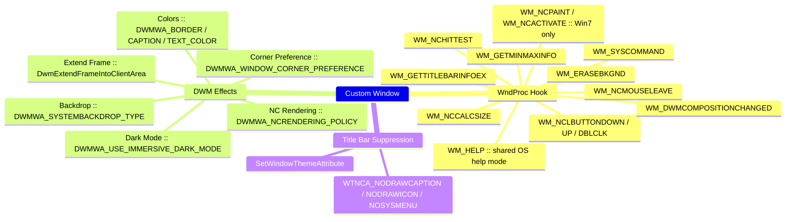
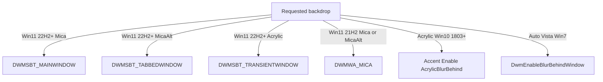

# Custom Window Chrome

Mutually exclusive capabilities are split by type instead of a mode flag:

| Class | Chrome | Responsibility |
|-------|--------|------|
| `WindowBase` (abstract) | — | Shared window infrastructure and native lifecycle |
| `SystemWindow` | System-provided (native frame untouched) | Native-frame enhancements |
| `ChromeWindow` | Custom (native caption removed) | Custom title bar and non-client pipeline |

`ChromeWindow` keeps the native frame styles (`WS_CAPTION | WS_THICKFRAME`)
and re-claims the non-client area through a `WndProc` hook plus DWM attributes.

## Startup Positioning

`WindowStartupLocation` keeps the normal WPF contract:

| Value | Initial target |
|-------|----------------|
| `CenterScreen` | Screen containing the mouse cursor (or the native owner monitor) |
| `CenterOwner` | WPF owner window; clamped to the owner monitor work area |
| `Manual` | WPF / caller supplied position; never corrected |

`WindowBase` starts the mixed-DPI correction at `SourceInitialized`, before the
first frame, then re-centers once at `Loaded` after `SizeToContent` layout.
`Loaded` or the first native move/size loop ends the startup-only tracking;
user-driven resize therefore leaves the opposite edge anchored. The correction uses
physical-pixel window and monitor rectangles for both axes, avoiding .NET
Framework PerMonitorV2 logical-coordinate conversion. This works around the
[WPF mixed-DPI positioning bug](https://github.com/dotnet/wpf/issues/4127).
Its first native move nudges the rectangle by one physical pixel so WPF adopts
the destination monitor DPI; the second applies the exact centered bounds.

A native owner, or a WPF owner in a non-normal state, follows WPF's
screen-centering fallback.

## Structure

| Type | Location | Role |
|------|----------|------|
| `WindowBase` | `WinCraft/UI/Controls/Window/` | Abstract shared layer; partial: properties (`WindowBase.cs`) + shared messages (`WindowBase.WndProc.cs`) |
| `SystemWindow` | `WinCraft/UI/Controls/Window/` | Native chrome + DWM enhancements; partial: properties (`SystemWindow.cs`) + NC message handling (`SystemWindow.WndProc.cs`) |
| `ChromeWindow` | `WinCraft/UI/Controls/Window/` | Custom chrome; partial: properties (`ChromeWindow.cs`) + NC message handling (`ChromeWindow.WndProc.cs`) |
| `TabWindow` and tab interaction types | `WinCraft/UI/Controls/Window/Tabs/` | Browser-style tabs, layout, drag session, and collection transfer; public namespace remains `WinCraft.UI` |
| `TitleBar` | `WinCraft/UI/Controls/Window/` | Standalone title bar with `Header`/`Content`/`Footer` slots — see [Title Bar](#title-bar) |
| `TitleBarPanel` | `WinCraft/UI/Controls/Window/` | Layout panel centering the `Content` slot on the full title-bar width |
| `TitleBarButton` | `WinCraft/UI/Controls/Window/` | Title-bar button, templated on `Glyph` |
| `WindowHitTestRole` / `WindowBackdropType` / `DwmColorMode` / `DwmCornerPreference` | `WinCraft/UI/Controls/Window/` | Behavior enums |
| `DwmBackdrop` / `DwmCorner` / `DwmDarkMode` / `DwmWindowAttribute` | `WinCraft/Infrastructure/DwmBackdrop.cs` | Version-gated DWM helpers |
| `BackdropThemeScope` | `WinCraft/UI/Theme/` | Applies the active backdrop palette below a window template |
| Default templates | `WinCraft/UI/Theme/Controls.Window.xaml` | Implicit styles: `SystemWindow`, `ChromeWindow`, `TitleBar`, `TitleBarButton` |

## Architecture



| Component | API | Purpose |
|-----------|-----|---------|
| NC area control | `WM_NCCALCSIZE` | Reserve the native resize frame — see [NC Area & Resize](#nc-area--resize) |
| Hit-testing | `WM_NCHITTEST` | Resize edges, title-bar drag, caption buttons |
| Maximize bounds | `WM_GETMINMAXINFO` | Clamp the maximized rect to the nearest monitor's work area |
| Interactive move/size | `WM_ENTERSIZEMOVE` / `WM_EXITSIZEMOVE` | Read-only `SizeMoveState` (None / Moving / Resizing; kind from the preceding `SC_MOVE`/`SC_SIZE`) — modal drag loop only, programmatic changes and Win+Arrow snaps stay None |
| Startup paint | `WM_ERASEBKGND` | See [Startup White Flash](#startup-white-flash) |
| Shadow | `DWMWA_NCRENDERING_POLICY` | System shadow |
| Glass frame | `DwmExtendFrameIntoClientArea` | Version/state-dependent margins — see [Glass Frame](#glass-frame) |
| Backdrop | `DWMWA_SYSTEMBACKDROP_TYPE` / Accent Policy | Mica / MicaAlt / Acrylic |
| Title bar suppression | `SetWindowThemeAttribute(WTNCA_NODRAWCAPTION \| NODRAWICON \| NOSYSMENU)` | Hide native caption drawing |
| Dark mode | `DWMWA_USE_IMMERSIVE_DARK_MODE` | `DwmUseDarkMode` (Win10 1809+) |
| Corner rounding | `DWMWA_WINDOW_CORNER_PREFERENCE` | System radius through `DwmCornerPreference`; see [Corner Rounding](#corner-rounding) |
| Border / caption / text colors | `DWMWA_BORDER / CAPTION / TEXT_COLOR` | See [DWM Colors](#dwm-colors-win11-22000) |
| Snap Layout | `WM_GETTITLEBARINFOEX` + `WM_NCHITTEST` | See [Snap Layout](#snap-layout) |
| Context help | `HTHELP` → `SC_CONTEXTHELP` → `WM_HELP` | See [Context Help](#context-help) |
| Composition change | `WM_DWMCOMPOSITIONCHANGED` | Re-detect DWM, reapply frame + effects + backdrop surface |
| Legacy frame | `WM_NCPAINT` / `WM_NCACTIVATE` | Win7 only — see [Legacy (Win7)](#legacy-win7) |

## Why Not Borderless

`WindowStyle=None` strips the entire non-client frame.  This forfeits every
system-provided window capability — reimplementing them in the client area is
fragile and incomplete:

| Lost Capability | Why It Matters |
|----------------|----------------|
| Maximize / restore animation | Window disappears and reappears; no smooth transition |
| Window shadow | DWM drops the shadow when non-client rendering is disabled |
| Snap Layout / Aero Snap | System relies on the native maximize-button region to trigger snap |
| Window docking | No frame geometry for docking to screen edges |
| Resize borders | Must be rebuilt entirely in the client area with manual hit-testing |
| DWM border color & corner rounding | `DWMWA_BORDER_COLOR` / `DWMWA_WINDOW_CORNER_PREFERENCE` have no surface to render on |
| Touch-friendly resize handles | `SM_CXPADDEDBORDER` padding is absent |

## Corner Rounding

`DwmCornerPreference` (default `Round`) maps 1:1 to
`DWM_WINDOW_CORNER_PREFERENCE` on Win11 21H2+. It is the supported path when
the system radius is sufficient.

## NC Area & Resize

### Resize Frame

The native resize band is reserved from the client area — `Width`/`Height`
include the invisible borders, exactly like native-frame windows.

NCCALCSIZE insets by state (Win8+; pre-Win8 see [Legacy (Win7)](#legacy-win7)):

| State | Insets |
|-------|--------|
| Normal, resizable | system frame left/right/bottom + 1 px top |
| Normal, `NoResize` / `CanMinimize` | 1 px top only |
| Maximized, resizable | full frame on every edge — system compensates the invisible border; prevents content bleeding onto adjacent monitors |
| Maximized, non-resizable | 1 px top only |

- `ResizeFrameThickness` (`Thickness`, default `NaN`) overrides the effective
  frame per edge in WPF units; `NaN` components fall back to system metrics
  (`SM_CX/CYSIZEFRAME` + `SM_CXPADDEDBORDER`, top: 1 px normal / full frame
  maximized).
- WinCraft includes `SM_CXPADDEDBORDER` (unlike WPF's `WindowChrome` which omits
  it) — guarantees the resize handle is wide enough for touch on tablets without
  needing a separate touch mode.
- All system-metric thicknesses are DPI-scaled via `GetDpiForWindow`.
  Frame-affecting property changes call `SetWindowPos(SWP_FRAMECHANGED |
  SWP_NOSIZE)` so DWM re-queries the NC area without resizing the window.

### Template Layout

WPF can arrange the template root before `WM_NCCALCSIZE` expands the client
area. A one-shot `LayoutUpdated` fix-up expands only the missing right and
bottom template margins; it applies on every supported Windows version.

### Drag Jitter

`WindowChrome` has a drag-jitter defect (dotnet/wpf#3193): position oscillates
between two NCCALCSIZE results during a drag.  WinCraft avoids it with four
measures:

| Measure | Mechanism | Root Cause |
|---------|-----------|------------|
| NCCALCSIZE dual-branch consistency | `wParam=TRUE` and `wParam=FALSE` return the same client rectangle. WPF queries `FALSE` for layout and `TRUE` for hit-testing; a mismatch snaps the origin between two calculations. | Position oscillation |
| 1 px top inset | A 1 px NC band at the top edge anchors the title bar. Without it, a drag starting on the title bar can momentarily enter the client area, hit-test misclassify, and trigger a frame recalculation that shifts the window. | Title-bar snap |
| `SWP_FRAMECHANGED` after DWM property changes | `DWMWA_NCRENDERING_POLICY`, `SetWindowThemeAttribute`, or backdrop changes must be followed by `SWP_FRAMECHANGED` — stale NC geometry produces a one-frame misalignment. | Visual jitter |
| No normal-state region churn | Client-frame mode updates the region only for maximized or non-DWM states; it does not update it during interactive sizing. | Left-edge resize oscillation |

## Startup White Flash

| Step | Message | Action |
|------|---------|--------|
| 1 | `WM_ERASEBKGND` | `FillRect` with `EraseBackgroundColor`, or opaque `Window.Background` when it is a `SolidColorBrush` |
| 2 | First render | WPF paints its normal background on the matching native surface |

- Opaque colors only (`A == 255`) — a translucent value disables the erase fill.
- Color format: `0x00BBGGRR`

## Backdrop Effects

### Selection

`BackdropType` defaults to `Auto`:

| `Auto` resolves to | OS |
|--------------------|-----|
| Mica | Win11 22H2+ |
| Acrylic | Win10 1803+ |
| Internal legacy blur | Vista / Win7 |
| None | otherwise |



- Win11 Mica, MicaAlt, and Acrylic use `DWMWA_SYSTEMBACKDROP_TYPE` directly;
  they do not fall back to Accent Policy.
- `MicaAlt` is the material that the original `Blur` option selected on Win11.
  `DWMSBT_TABBEDWINDOW` is Mica Alt, not blur; the option is now named after the
  material it actually requests.
- `BlurBehind` is not a public `WindowBackdropType`: Win11 has no matching
  system material. `ACCENT_ENABLE_BLURBEHIND` remains an internal drag fallback,
  ahead of the classic DWM API; classic DWM is retained for the `Auto` path on
  Vista and Windows 7.
- `AcrylicGradientColor` (default 80% white) is passed as
  `ACCENT_POLICY.GradientColor` on the Win10 Acrylic path.

### Acrylic Drag Lag Fallback

`SetWindowCompositionAttribute` with `ACCENT_ENABLE_ACRYLICBLURBEHIND` can show
an observed performance issue on Windows 10: during interactive window move or
resize the window visibly lags behind the cursor. DWM pauses the legacy accent
pipeline during drag but does not pause the lighter `ACCENT_ENABLE_BLURBEHIND`
path.

WinCraft works around this automatically:

| Event | Action |
|-------|--------|
| `WM_ENTERSIZEMOVE` (drag start) | `BeginDragFallback` — temporary switch from Acrylic to legacy blur accent |
| `WM_EXITSIZEMOVE` (drag end) | `EndDragFallback` — restore the original backdrop |

The fallback only activates when the backdrop is served by the legacy
`SetWindowCompositionAttribute` path (i.e., below Win11 22H2).  When the
backdrop uses `DWMWA_SYSTEMBACKDROP_TYPE` the modern composition pipeline
does not exhibit the bug, so the fallback is a no-op.

### Glass Frame

| Condition | `DwmExtendFrameIntoClientArea` margins |
|-----------|----------------------------------------|
| Pre-Win8 | zero |
| `BackdropType != None` on Win11 21H2+ | `(-1,-1,-1,-1)` FullGlass — the backdrop's render surface; reapplied after maximize/restore to track native frame geometry |
| otherwise | `cyTopHeight = 1` — a single 1 px frame extension is enough for DWM to render the shadow; direction does not matter |

### Transparent Layers

| Layer | Property | Value |
|-------|----------|-------|
| WPF backdrop surface | Window template root | `Transparent` via `IsBackdropActive` trigger |
| D3D surface | `CompositionTarget.BackgroundColor` | `Transparent` when a backdrop is active, `SystemColors.WindowColor` otherwise |
| WPF content brushes | Template-local `BackdropThemeScope` | Applies `Brushes.{theme}.Backdrop.xaml` below the window template, so the system material remains visible behind content |
| Glass frame | `DwmExtendFrameIntoClientArea` | Uses the margin policy in [Glass Frame](#glass-frame). |

- `IsBackdropActive` (read-only) is true when DWM is on and
  `BackdropType != None`; `Window.Background` itself is unchanged.
- `WindowBase` has no theme-resource dependency. `BackdropThemeScope` observes
  `IsBackdropActive` from the template and owns the optional backdrop palette.

### Taskbar Thumbnail Trade-off

An active backdrop makes the WPF root and D3D surface transparent so DWM can
compose Mica or Acrylic behind the application. The native taskbar thumbnail
uses that redirected surface; pixels in an off-screen portion that WPF has not
rendered can therefore show the default white surface instead of the backdrop.
This is not Mica-specific: any transparent composition surface can show it,
including the internal Vista/Win7 legacy-blur path. With no active backdrop,
`CompositionTarget.BackgroundColor` remains opaque, so this particular cause
does not apply.

| Option | Off-screen thumbnail pixels | Chrome fidelity |
|--------|-----------------------------|----------------|
| Native DWM thumbnail (used) | May be white for transparent, unrendered off-screen pixels | Native corner radius, shadow, and caption stay exact |
| Application-owned iconic bitmap | Can composite an opaque fallback color | Requires recreating corner clipping, shadow, and caption; differs from the live DWM frame |

The native path is retained.  `WM_ERASEBKGND` cannot target only the taskbar
thumbnail, so it cannot correct this artifact without changing the live
transparent backdrop surface.

### Persistent Active Visuals

By default, DWM switches Mica and the native frame to their inactive visual
state when a window loses focus. `KeepActiveVisuals = true` retains active
DWM visuals: Mica intensity, native caption background/text/buttons, and shadow.

| Class | Mechanism |
|-------|-----------|
| `ChromeWindow` | `HandleNcActivate` passes `wParam = TRUE` to `DefWindowProc`, retaining the active Mica intensity and DWM shadow. |
| `SystemWindow` | The same mechanism also retains the native title-bar background, text, caption buttons, Mica intensity, and DWM shadow. |
| Win11 22H2+ | Mica via `DWMWA_SYSTEMBACKDROP_TYPE` — fully supported. |
| Win11 21H2 | Mica via undocumented `DWMWA_MICA` — likely effective (same DWM material). |
| Win10 1803+ | Acrylic via `SetWindowCompositionAttribute` — no activation-state effect. |
| Vista / Win7 | Internal legacy blur via `DwmEnableBlurBehindWindow` — no activation-state effect. |

## DWM Colors (Win11 22000+)

| Attribute | Value | Property Pair |
|-----------|-------|---------------|
| `DWMWA_BORDER_COLOR` | 34 | `DwmBorderColorMode` + `DwmBorderColor` (`WindowBase`) |
| `DWMWA_CAPTION_COLOR` | 35 | `DwmCaptionColorMode` + `DwmCaptionColor` (`SystemWindow` only — needs a native caption) |
| `DWMWA_TEXT_COLOR` | 36 | `DwmTextColorMode` + `DwmTextColor` (`SystemWindow` only) |

- `COLORREF` format `0x00BBGGRR` — no alpha channel; the color DPs reject
  translucent values at set time (`ValidateValueCallback`).

| `DwmColorMode` | COLORREF | Notes |
|----------------|----------|-------|
| `Default` | `0xFFFFFFFF` | System decides (follows theme/accent) — DP default, so a bare window keeps system behavior |
| `None` | `0xFFFFFFFE` | Border: suppressed. Caption: with an active backdrop, DWM extends the material through the native title bar; without one it has no visible effect. Text: coerced to `Default` because DWM has no defined no-text state. |
| `Custom` | paired color property → COLORREF | Theme styles set `Custom` + dynamic-resource colors (`WindowDwmCaptionColor` / `WindowDwmTextColor`) |

- Theme dictionaries supply defaults via dynamic resources:
  `WindowDwmUseDarkMode`, `WindowDwmCaptionColor`, `WindowDwmTextColor`,
  `WindowAcrylicGradientColor`.

### SystemWindow Title-Bar Backdrop

On Win11 22H2+, a native `SystemWindow` title bar shows the system backdrop when
these settings are combined:

| Property | Value | Purpose |
|----------|-------|---------|
| `BackdropType` | `Mica`, `MicaAlt`, or `Acrylic` | Selects the DWM material. |
| `DwmCaptionColorMode` | `None` | Lets the active backdrop extend through the native title bar; no visible effect when `BackdropType = None`. |
| `DwmTextColorMode` | `Default` or `Custom` | Keeps the native title text visible. |
| `KeepActiveVisuals` | `true` (optional) | Retains the active material, caption, and shadow while inactive. |

## Title Bar

`TitleBar` is a standalone control hosted in row 0 of the `ChromeWindow`
template.  Icon, default title, and the four `TitleBarButton`s are fixed
template parts; three object DPs are empty extension slots:

| Slot | Position | Notes |
|------|----------|-------|
| `Header` | After the icon | Replaces the built-in title text when set — `null` shows the window `Title` (Caption role, draggable); user content gets `Client` role (interactive) |
| `Content` | Centered on the **full** title-bar width | `TitleBarPanel` clamps it between neighbors; shrinks/collapses instead of overlapping when narrow |
| `Footer` | Before the caption buttons | |

- Slot presenters carry `HitTestRole="Client"`; the `TitleBar` itself carries
  `Caption` (style setter), so empty areas drag the window.
- The window template's `AdornerDecorator` wraps title bar + content together,
  so slot content gets focus/validation/caret adorners.
- `TitleBarPanel` caps and centers the `Content` slot between the left and right
  groups; the left group clips before it can overlap the right one.
- All window state reaches the template through
  `RelativeSource AncestorType=ui:ChromeWindow` bindings: `Title`,
  `EffectiveIcon`, commands, and visibility DataTriggers. Without a
  `ChromeWindow` ancestor, the control renders empty.

### Retemplating

Override the implicit `Style TargetType="ui:TitleBar"` (app- or window-level
resources).  A custom template must keep:

1. `ChromeWindow.HitTestRole="Caption"` on the root (dragging) — supplied
   by the style setter unless overridden.
2. `HitTestRole` on caption buttons (`Minimize`/`Maximize`/`Close`/`Help`).
3. Ancestor bindings for title, icon, and commands.

## Caption Buttons

Buttons live in the `TitleBar` template (`x:Name`: `HelpButton`,
`MinimizeButton`, `MaximizeButton`, `CloseButton`).

| Button | Visible When |
|--------|--------------|
| Close | `ShowClose` (default `true`) |
| Maximize | `ShowMaximize && ResizeMode >= CanResize` |
| Minimize | `ShowMinimize && ResizeMode != NoResize && ShowInTaskbar` |
| Help | `ShowHelp` (default `false`) |

`ShowMinimize` / `ShowMaximize` / `ShowClose` gate the full capability, not just
the button:

| Property | Coupled behavior when `false` |
|----------|------------------------------|
| `ShowMinimize` | `WS_MINIMIZEBOX` stripped (taskbar command, Win+Down); `MinimizeCommand` no-op |
| `ShowMaximize` | `WS_MAXIMIZEBOX` stripped (Win+Up, Aero Snap, Snap Layout); title-bar double-click and `MaximizeRestoreCommand` blocked — restoring an already maximized window stays allowed |
| `ShowClose` | `SystemWindow` grays the native caption button and menu item; `SC_CLOSE` from them and Alt+F4 is swallowed. Programmatic `Close()` is unaffected. |

- Style bits derive from `ComputeWindowStyle(style, minBox, maxBox)` where
  `minBox`/`maxBox` AND the toggle with the `ResizeMode` baseline; reapplied on
  `ResizeMode` change.

- Inheritable `HitTestRole` attached property on title-bar elements maps to the
  corresponding `HT*` code via `WM_NCHITTEST`. `Caption` enables dragging;
  `Client` excludes children from drag. Points inside the title bar with no role
  default to `HTCAPTION`.
- Screen rectangles via `PointToScreen`; consistent across NCCALCSIZE origin changes.

| State | Property | Set By |
|-------|----------|--------|
| Hover | `IsNonClientHovered` | `WM_NCHITTEST` |
| Pressed | `IsNonClientPressed` | `WM_NCLBUTTONDOWN` / `WM_NCLBUTTONUP` |
| Cleared | Both reset | `WM_NCMOUSELEAVE` / `OnStateChanged` |

- After each hover-setting `WM_NCHITTEST`, `TrackMouseEvent(TME_NONCLIENT)` is
  re-requested — when a WPF popup captures the mouse, `WM_NCMOUSEMOVE` is
  rerouted and `DefWindowProc` would never arm `WM_NCMOUSELEAVE`.
- `IsWindowActive` (read-only, from `OnActivated`/`OnDeactivated`) dims the
  title text and caption buttons to `TextDisabled` when the window is inactive.

Colors from theme: `ControlHoverBackground` / `ControlPressedBackground`. Close
button uses `{DynamicResource Error}`.

## Context Help

All triggers converge on the same hand-written help loop in `WindowBase`
(question cursor, mouse capture, Esc to cancel, `WM_LBUTTONDOWN` dispatches).
The next click's screen coordinates resolve through `DispatchHelpRequestAt`
→ element normalisation → inherited `HelpTopic` → `HelpCommand` (data token,
never a view object) → `HelpRequested` fallback.

| Trigger | Mechanism |
|---------|-----------|
| F1 | `CommandBinding` for `ApplicationCommands.Help`. Topic resolves from keyboard focus. Claimed only while `HelpCommand`/`HelpRequested` is wired; inner bindings override by routed-command precedence. The squelch flag suppresses the `WM_HELP` DefWindowProc generates when the focused element doesn't swallow F1 itself. |
| Template help button (`ChromeWindow`) | `HTHELP` in `HandleNcLButtonUp` → `EnterHelpMode()` |
| Native help button (`SystemWindow`) | DWM sends `SC_CONTEXTHELP`; the base intercepts it in `WM_SYSCOMMAND` before DefWindowProc and calls `EnterHelpMode()` |

`WindowBase.ShowHelp` (default `false`) authorises each class's trigger:
`ChromeWindow` binds it to template visibility; `SystemWindow` toggles
`WS_EX_CONTEXTHELP`.  Win32 renders the native help button only when the
minimize/maximize boxes are absent — DWM caption layout, not bypassable.
Combine `ShowHelp` with `ShowMinimize`/`ShowMaximize` = false or
`ResizeMode=NoResize`.

### Usage

```xaml
<ui:ChromeWindow ShowHelp="True"
                 HelpCommand="{Binding ShowHelpCommand}"
                 ui:WindowBase.HelpTopic="main-window">
    <StackPanel ui:WindowBase.HelpTopic="network-page">
        <TextBox />                                        <!-- inherits network-page -->
        <Button ui:WindowBase.HelpTopic="proxy-config" />  <!-- nearest declaration wins -->
    </StackPanel>
</ui:ChromeWindow>
```

```csharp
// ViewModel — receives the topic token, never a view object
public ICommand ShowHelpCommand { get; }
    = new RelayCommand<object>(topic => HelpViewer.Open((string)topic));

// View-layer fallback (code-behind) when no command is bound
window.HelpRequested += (_, e) => MessageTip.Show($"Help: {e.Topic}");
```

## Snap Layout

```mermaid
flowchart TD
    Hover[Hover over maximize button] --> Hittest[WM_NCHITTEST → HTMAXBUTTON]
    Hittest --> Custom[System uses WM_GETTITLEBARINFOEX rgrect[3]]
    Custom --> UIPI[WM_GETTITLEBARINFOEX filtered by UIPI if elevated]
```

| Mechanism | Scope |
|-----------|-------|
| `WM_NCHITTEST` → `HTMAXBUTTON` | Triggers snap layout on maximize-button hover |
| `WS_SYSMENU` permanently absent | All `ChromeWindow` configurations; no hover-time style transition |
| `WM_GETTITLEBARINFOEX` → `rgrect[3]` | Returns the maximize button screen rect (24H2+); other fields left as-is |
| `ChangeWindowMessageFilterEx` | Allows `WM_GETTITLEBARINFOEX` through UIPI when elevated |

### `WS_SYSMENU` Policy

`WS_SYSMENU` enables the native system menu. `ChromeWindow` removes it and
does not provide an equivalent menu.

| Effect of removal | Benefit / cost |
|-------------------|----------------|
| Snap Layout | With `WS_SYSMENU`, only the part of the custom maximize button within the native caption height triggers Snap Layout. Without it, 24H2+ uses the full `WM_GETTITLEBARINFOEX` rectangle. |
| Semi-transparent title bar | DWM no longer exposes native caption-button pixels through the custom title-bar background. |
| Native system menu | Alt+Space, title-icon click, and title-bar right-click menus are unavailable. |

### Version matrix

| Windows build | Snap Layouts | WM_GETTITLEBARINFOEX respected | Workaround needed |
|---------------|-------------|-------------------------------|-------------------|
| 21H2 – 23H2 | Yes | No | WinEvent hook¹ |
| 24H2+ | Yes | Yes (when WS_SYSMENU absent) | None |

¹ Not implemented — the pre-24H2 workaround registers
`EVENT_OBJECT_CREATE` / `EVENT_OBJECT_SHOW` with `SetWinEventHook`, identifies
the flyout by the undocumented `XamlExplorerHostIslandWindow` class, and calls
`SetWindowPos` before paint. Because it needs a global hook and an undocumented
class, pre-24H2 builds retain native positioning.

### Caption Artifact Without a Reserved Resize Frame

A window with an active backdrop and a semi-transparent `BgSecondary` title-bar
brush can reveal DWM caption pixels while `WS_SYSMENU` is present. This occurs
without a reserved resize frame and when a resizable window is maximized.

| Policy | Result | Trade-off |
|--------|--------|-----------|
| Permanent `WS_SYSMENU` removal | `ChromeWindow` removes it for every configuration, including maximized windows. | System menu and its triggers are unavailable. |
| Opaque title-bar brush | Retains `WS_SYSMENU` and native system-menu behavior. | The title bar does not show the backdrop. |

Use `SystemWindow` or the opaque-brush policy when a window needs a system menu.

## Window Icon

`ShowIcon` belongs to `WindowBase` and defaults to `true`:

| Class | `ShowIcon = false` behavior |
|-------|-----------------------------|
| `ChromeWindow` | Collapses the template's title-bar image. |
| `SystemWindow` | Adds `WS_EX_DLGMODALFRAME`, clears the HWND's `ICON_SMALL` / `ICON_BIG`, and redraws the native frame. The previous style and icon handles are restored when re-enabled. |

While a `SystemWindow` icon is hidden, later `WM_SETICON` messages update the
saved handles without making the native icon visible. This keeps runtime
changes to `Window.Icon` consistent with `ShowIcon`.

For `ChromeWindow`, `EffectiveIcon` (read-only) feeds the template's title-bar
image. Resolution order:

| Resolution order | Source |
|-----------------|--------|
| 1 | `Window.Icon` |
| 2 | `WM_GETICON` (`ICON_SMALL2`) |
| 3 | Window-class small icon |
| 4 | Window-class large icon |
| 5 | `SystemIcons.Application` |

- Icon handles are borrowed, copied to a WPF image, and never destroyed.
- `HTSYSMENU` on icon: left-click → menu, double-click → default system command.

## Legacy (Win7)

Pre-Win8, DWM cannot fully replace the frame; a separate path applies:

| Concern | Behavior |
|---------|----------|
| NCCALCSIZE | No insets — the client area covers the full window rect |
| `WM_NCPAINT` | Suppressed; prevents the legacy frame painting over the client-owned area |
| `WM_NCACTIVATE` | Handled with `TRUE` (except minimized) — preserves activation state without repainting the replaced frame |
| Resize band | `DWMWA_EXTENDED_FRAME_BOUNDS` inset within the window rect; 1 px interior fallback when unavailable |
| Glass frame | Zero margins |
