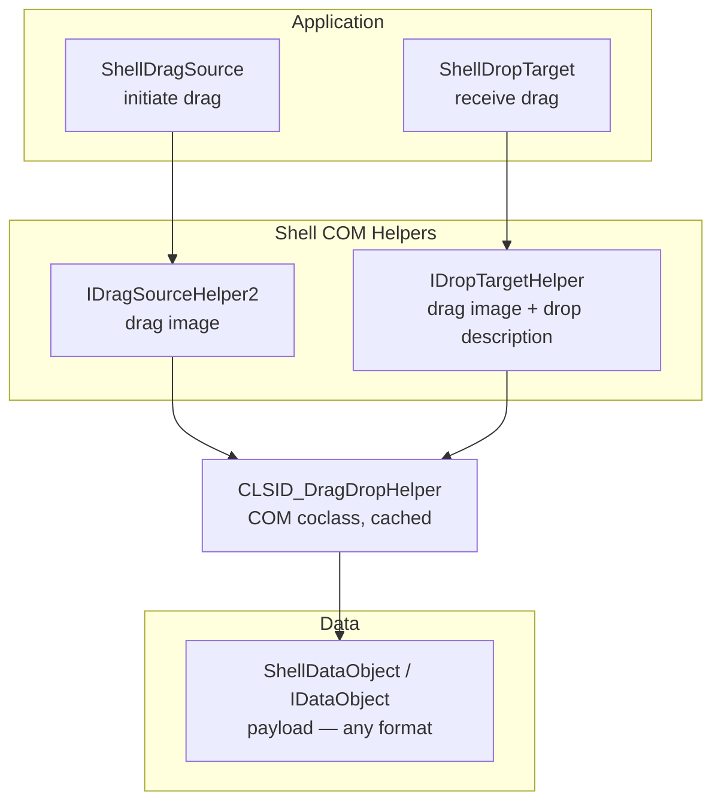

# Shell Drag-and-Drop

## Architecture



| Layer | Role |
|-------|------|
| Application | Public API — start / receive drag |
| Shell COM Helpers | Render drag image via `CLSID_DragDropHelper` |
| Data | COM data object for Shell formats, packaging only |

## Initiate a Drag

```csharp
// Create data payload.
var data = new ShellDataObject();
data.SetText("hello");                       // text
// data.SetFileDrop(new[] { "C:\\file.txt" }); // file list
// data.SetData("MyFormat", someObject);       // arbitrary object

// Drag image
using (var bitmap = new Bitmap("image.png"))
{
    ShellDragSource.DoDragDrop(
        element,        // WPF UIElement
        data,           // IDataObject payload
        DragDropEffects.Copy | DragDropEffects.Move,
        bitmap,         // drag image
        offset: null);  // default: bottom-left of bitmap
}
```

`DoDragDrop` must be called from a mouse event handler (e.g. `MouseMove`).

### Cursor fallback

When the Shell layered drag window is unavailable (e.g. in elevated/admin
processes where UIPI blocks Shell messages), `ShellDragSource` falls back
to a custom cursor created from the drag bitmap.  This is controlled by
`ShowDragImageWhenNotSupported` (default `true`).  Disable it to always
use the system default cursor when Shell cannot render the drag image.

## Receive a Drag

```csharp
// One-line registration with drop callback.
ShellDropTarget.Register(this, DragDropEffects.Copy, args =>
{
    // Handle dropped data via args.Data
});
```

The Shell drop image is handled automatically.  To also show a drop
description tooltip, call `SetDropDescription` separately before the drop
(e.g. in response to detecting the dragged content type).

## Custom Data Formats

WPF's `DataObject` does not support arbitrary `System.Runtime.InteropServices.ComTypes.IDataObject`
formats.  Use `ShellDataObject` for Shell-specific or custom HGLOBAL formats:

```csharp
var sdo = new ShellDataObject();
var fmt = DataObjectExtensions.CreateFormatEtc("MyFormat");
var medium = new STGMEDIUM { tymed = TYMED.TYMED_HGLOBAL, unionmember = hMem };
sdo.SetData(ref fmt, ref medium, true);

ShellDragSource.DoDragDrop(element, sdo, effects, bitmap);
```

## SHCreateDataObject (Future)

For creating Shell file-drop data from paths or PIDLs, the Windows API
`SHCreateDataObject` (shell32.dll) generates an `IDataObject` carrying
all standard Shell drag formats (Shell IDList, FileGroupDescriptor,
FileContents).  This requires parsing file paths into PIDLs via
`SHParseDisplayName`, and both APIs take COM types that CsWin32 cannot
generate on net30.

When `net30` support is dropped, add `SHCreateDataObject` and
`SHParseDisplayName` to CsWin32's `NativeMethods.txt`.  Until then, a
hand-written wrapper can be added to `Interop/` following the convention
in `docs/rules/win32-interop.md`.
