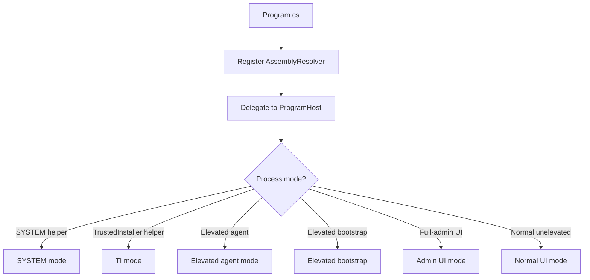

# Startup Lifecycle

## Purpose

This document explains the application entry point and startup ownership model.
It stays at the composition level: process roles, WPF application setup, and
single-instance activation. Privileged host IPC details live in
`docs/features/elevated-agent-ipc.md`.

## Entry Point



Portable artifacts start in `WinCraft.Portable/Program.cs`. It registers
`AssemblyResolver` before touching code that may live in bundled dependency
assemblies, then delegates startup routing to `ProgramHost`. Keep this ordering
intact: portable host code should not touch `WinCraft` types before the resolver
is registered, because portable release artifacts load Core from the compressed
PE overlay instead of from a sidecar DLL.

Installer artifacts compile `WinCraft` itself as `WinCraft.exe` with
`InstallerBuild=true`; `Startup/Program.cs` delegates directly to
`ProgramHost` because dependency assemblies are installed as sidecar files.

`ProgramHost` routes by process mode. Keep this centralized in
`WinCraft.Startup`. New startup modes enter through `Program`, route through
`ProgramHost`, and delegate to focused startup or feature code when behavior
grows beyond startup composition.

## WPF Application Object

`App.xaml` exists at the project root to define the WPF `Application` type and hold application
resources. It is not the startup driver.

`UserInterfaceStartup` creates `App` and `MainWindow` directly and owns the
full startup composition: it initializes application resources, registers
dispatcher exception handling, sets the main window, initializes application
services, and runs the dispatcher through the single-instance host. This keeps
startup decisions in ordinary C# code where command-line mode checks, elevation
routing, and service setup can be ordered explicitly.

`App.xaml.cs` should be lightweight. Add code-behind logic only when the
application needs real WPF application-level event handling or shared
`Application` state.  Do not add it just to move startup code out of
`Program`; startup routing and process selection belong in `WinCraft.Startup`.

### Designer Resource Resolution

`App.xaml` lives at the project root of `WinCraft`, a DLL project. WPF does not allow
`ApplicationDefinition` in library projects (error MC1002), so
`EnableDefaultApplicationDefinition` is set to `false`.

WPF may still auto-detect `App.xaml` as an `ApplicationDefinition` when a
code-behind file (`App.xaml.cs`) is present because the root element is
`<Application>`.  To prevent this during normal builds, the project file
removes `App.xaml` from the `ApplicationDefinition` item group:

```xml
<PropertyGroup>
    <EnableDefaultApplicationDefinition>false</EnableDefaultApplicationDefinition>
</PropertyGroup>

<ItemGroup Condition="'$(DesignTimeBuild)' == 'false'">
    <ApplicationDefinition Remove="App.xaml" />
</ItemGroup>
```

During design-time builds (`$(DesignTimeBuild)` is `true`), the `Remove` is
skipped.  WPF auto-detection then treats `App.xaml` as an
`ApplicationDefinition`, allowing the Visual Studio XAML designer to resolve
implicit styles and `StaticResource` references defined in `App.xaml`'s
merged dictionaries.

## Single Instance Model

The visible UI runs as a single unelevated instance. `SingleInstanceHost` owns
that policy and runs the WPF dispatcher for the first instance.

When a later process starts with additional command-line arguments, the existing
UI receives the activation through `StartupNextInstance`. The active UI brings
its main window forward and handles the incoming command-line context.

This keeps shell interaction, drag-and-drop, and window activation in the
unelevated UI process. Elevated handoff behavior is part of the privileged host
model and is covered in `docs/features/elevated-agent-ipc.md`.

Built-in Administrator and other non-split-token administrator sessions run the
UI directly instead of launching a separate unelevated copy. In that account
model the shell token already has the same administrator capability, so a
"downgrade" through Explorer would not reduce the UI token. Administrator-level
operations execute in-process, while `TrustedInstaller` operations still use the
privileged bridge.

## Design Notes

- Keep reusable process, command-line, IPC, and elevation helpers outside
  `ProgramHost` when they are not startup-specific.
- Prefer adding focused infrastructure types over growing long inline startup
  workflows when a flow needs independent testing or reuse.
