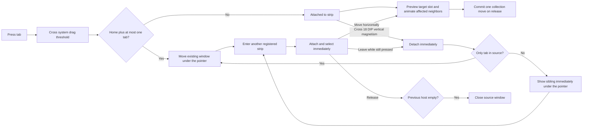

# Tabbed Window

| Type | Role |
|------|------|
| `TabWindow` | `ChromeWindow` shell with bindable tabs, selected content, close/new commands, tear-off, and cross-window transfer |
| `WindowTabStrip` | Captured-pointer drag source, target registry, and cross-window hit testing |
| `WindowTabPanel` | Equal-width tab layout with independent dragged and neighbor slots |
| `TabDragSession` | Attached, detached, cross-window, completion, and cancellation state machine |
| `WindowTabItem` | Browser-shaped generated item container and drag state |
| `TabCollectionTransfer` | Reference-preserving reorder/transfer logic; uses `ObservableCollection<T>.Move` when available |

## Interaction

The drag keeps the original horizontal grab ratio inside the tab. Window
movement uses screen-pixel deltas so the grab point remains stable across WPF
layout and DPI transforms. Entering a strip transfers the tab immediately;
leaving its vertical magnetism band tears it back into the same reusable
floating window. The pointer remains captured for the whole gesture, so this
attach/detach cycle can repeat without releasing the mouse. The dragged tab and
animated neighbor slots communicate the insertion position without a separate
marker.

A window with `HomeTab` and no more than one additional tab uses its tab area
only to move the existing window. This keeps the home-only state draggable and
prevents its first content tab from tearing off into a sibling window. The home
tab remains in its source window; drag-created siblings contain only transferred
tabs and can merge back normally.

Re-dragging a previously detached one-tab window follows the same path. When
its tab attaches, the now-empty source shell is concealed while it retains
mouse capture; leaving the target reveals and repositions it under the pointer
again. Releasing over the target closes the empty source instead of leaving it
visible underneath the merged window.

Tabs keep their configured width while space is available and shrink evenly
down to `TabMinWidth`. A `HomeTab` has an independent icon-only width and does
not consume the normal minimum. Once the minimum-width tabs no longer fit, the strip
keeps that floor and shows back/forward buttons on its two sides. Button
scrolling is animated, selecting a hidden tab reveals it, and dragging near a
viewport edge scrolls the strip automatically. `WindowTabItem.IsCompact` lets
header templates collapse optional title and action content when an application
chooses a small minimum. The tab strip keeps the full title-bar slot when tabs
are removed, so remaining tabs can expand and the trailing area remains
available as an attach target.

Closing a tab immediately recalculates the remaining tab widths and overflow
buttons from the current available space. The strip does not retain a
mouse-close layout mode or defer later layout updates.

Realized tab items remain client input, while the strip's trailing blank area
retains caption hit testing for window drag, maximize/restore double-click, and
the system-menu right-click. A drag-created sibling keeps its own
`NewTabCommand`, or inherits the source command when it does not define one.
Data-bound `Tabs`, `SelectedTab`, and `NewTabCommand` values are activated
before the sibling's starter tabs are cleared, keeping the detached window
connected to its own view model.
The tabbed-window types are physically grouped under
`WinCraft/UI/Controls/Window/Tabs/` while retaining the public `WinCraft.UI`
namespace. The default `TabWindow` style keeps `ChromeWindow`'s system resize
frame mode, so Windows owns the sizing rectangle and edge controls do not share
the resize hit-test band.

## Shortcuts and Mouse Commands

| Input | Action |
|-------|--------|
| `Ctrl+T` | Execute `NewTabCommand` when available |
| `Ctrl+W` | Close the selected closable tab |
| `Ctrl+Tab` / `Ctrl+Shift+Tab` | Select the next / previous tab, wrapping at the ends |
| `Ctrl+1`–`Ctrl+8` / `Ctrl+9` | Select tab 1–8 / the last tab |
| Middle-click a tab | Close a closable tab |

## Data Contract

| Property | Requirement |
|----------|-------------|
| `Tabs` | Mutable `IList`; `ObservableCollection<T>` gives a single `Move` notification during reorder |
| `SelectedTab` | Two-way by default |
| `TabHeaderTemplate` | Header-only visuals; buttons do not initiate drag |
| `TabContentTemplate` | Selected item content |
| `NewTabCommand` | Optional; null hides the add button |
| `ShowNewTabButton` | Controls add-button visibility independently of the command |
| `TitleBarFooter` | Optional content before the add button and caption buttons |
| `HomeTab` | Optional fixed first tab; cannot close or move, uses an icon-only container width, and remains in its source window during tear-off |
| `TabMinWidth` | Hard minimum tab width; overflow activates two-sided scrolling |
| `TabMaxWidth` | Maximum width used while tabs have enough space to expand |

`CreateSiblingWindow()` uses the runtime window type and requires a public
parameterless constructor. Override it when construction needs external state.
