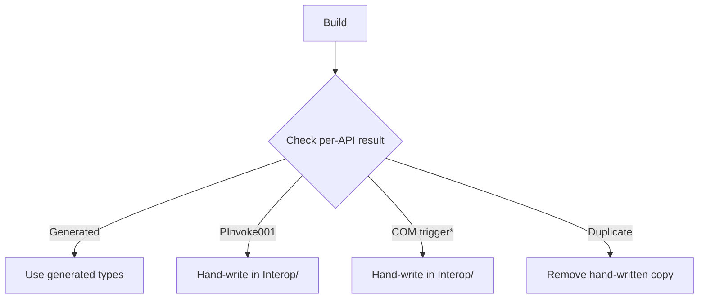

# Win32 Interop

## CsWin32

Add APIs to `NativeMethods.txt` and build.  Group by functional area
(e.g. `Shell — File Associations`), not data type (`Constants`).

When adding multiple APIs, inspect warnings individually — one `PInvoke001`
does not mean the whole batch failed.  Check `obj/<config>/<tfm>/generated/
Microsoft.Windows.CsWin32/` and only hand-write the failures.

Per-API result:

\* API signature touches `IShellItem`, `IDataObject`, `IStream`, or any `I*` Shell COM interface.

## String Buffers

Use `StringBuffer` (`Interop/StringBuffer.cs`) for all native string I/O —
no hand-written `stackalloc char`, `fixed (char*)`, or `\0` logic.

Match buffer size to `cch`.  Don't pin a short managed string and claim
`MAX_PATH` — use `stackalloc` or `HeapWrite` instead.

## COM on net30

CsWin32 COM generation requires `System.Runtime.CompilerServices.Unsafe` and
`AggressiveInlining`, neither available on net30.  Use traditional
`[ComImport]` in `Interop/` instead.

Hand-written conventions:
- Namespace matches CsWin32 (`Windows.Win32.UI.Shell` for COM, `Windows.Win32` for P/Invoke)
- P/Invoke files: `PInvoke.{Dll}.cs` with `private const string` for DLL name
- COM files: named after type (`IShellLink.cs`)
- Enums/structs: ALL_CAPS; prefer CsWin32 generation over hand-writing
- HRESULT: `.Failed` / `.Succeeded`, not `== 0`

## Windows Compatibility

Guard or document APIs that rely on UAC, split tokens, or elevation metadata.
Targeting .NET 3.0 does not imply pre-Vista Windows.
